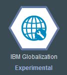
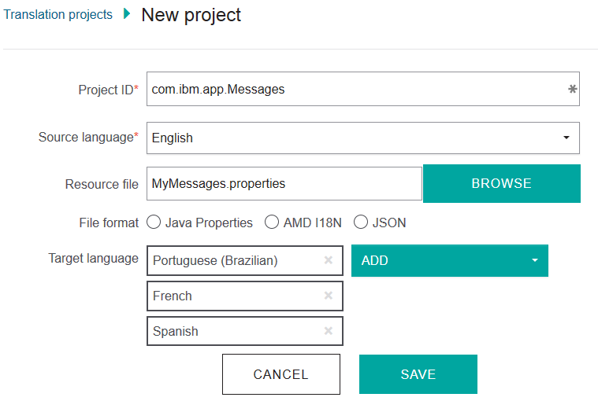
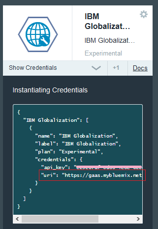
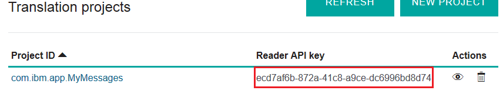

Java Client for Bluemix IBM Globalization Service
===
<!--
/*  
 * Copyright IBM Corp. 2015
 *
 * Licensed under the Apache License, Version 2.0 (the "License");
 * you may not use this file except in compliance with the License.
 * You may obtain a copy of the License at
 *
 * http://www.apache.org/licenses/LICENSE-2.0
 *
 * Unless required by applicable law or agreed to in writing, software
 * distributed under the License is distributed on an "AS IS" BASIS,
 * WITHOUT WARRANTIES OR CONDITIONS OF ANY KIND, either express or implied.
 * See the License for the specific language governing permissions and
 * limitations under the License.
 */
-->

# What is this?

This is a Java client library for the
[Bluemix IBM Globalization Service](https://www.ng.bluemix.net/docs/#services/Globalization/index.html#globalization).

In a Java applications, localized UI strings are usually stored in Java resource bundle class files or in
Java properties files. These localized strings are accessed through
[java.util.ResourceBundle](http://docs.oracle.com/javase/8/docs/api/java/util/ResourceBundle.html) class.
The ResourceBundle class provides a way to support custom resource bundle formats by specifying a custom
instance of [ResourceBundle.Control](http://docs.oracle.com/javase/8/docs/api/java/util/ResourceBundle.Control.html).
This library contains an implementation of ResourceBundle.Control which looks up and load resource strings
from a IBM Globalization project.

# Usage

## Minimum requirements

This library requires Java 7 or later version of Java Runtime Environment.

To build the library from the source files, JDK 8 is required.

## Creating a new translation project

To use the IBM Globalization service with your application, complete following steps to create a
new translation project.

1) From the Bluemix dashboard, select Catalog to view a list of current services.

2) Select the IBM Globalization service from the DevOps category of Bluemix services.

3) Choose a Bluemix space and existing application to bind the service to.

4) Click the IBM Globalization service icon in your Bluemix space to open the IBM Globalization
service dashboard.

5) Click NEW PROJECT. In the screen, use your Java resource bundle's base name (e.g. com.ibm.app.MyMessages)
as Project ID, select target languages you want and upload your bundle (Java Properties).

## Accessing translated resources from a Bluemix Java application

Once a new project is created, and the contents in the source language is uploaded, your Bluemix
Java application can use translated results through Java's standard
[ResourceBundle](http://docs.oracle.com/javase/8/docs/api/java/util/ResourceBundle.html) class,
with the custom [ResourceBundle.Control](http://docs.oracle.com/javase/8/docs/api/java/util/ResourceBundle.Control.html)
implementation included in this library.

Your original code may look like below:

    ...
    Locale locale;  // the target language
    ...
    
    ResourceBundle rb = ResourceBundle.getBundle("com.ibm.app.MyMessages", locale);
    String msgHello = rb.getString("msg.hello");

The code above should be changed to:

    import java.util.ResourceBundle.Control;
    import com.ibm.gaas.CloudResourceBundleControl;
    import com.ibm.gaas.ServiceAccount;
    ...
    Locale locale;  // the target language
    ...
    // ServiceAccout object is initialized with the
    // credentials in VCAP_SERVICES. The no-args factory
    // method is sufficient if an application binds to
    // a single IBM Globalization service instance.
    ServiceAccount account = ServiceAccount.getInstance();

    // The custom control for loading resources from
    // a translation project managed by the IBM Globalization service.
    Control ctrl = CloudResourceBundleControl.getInstance(account);

    // ResourceBundle is created with the custom control
    ResourceBundle rb = ResourceBundle.getBundle("com.ibm.app.MyMessages",
                                locale, ctrl);
    String msgHello = rb.getString("msg.hello");

With the code above, your application will retrieve a translated resource string from
your translation project. If the specified language (Locale) is not available in the
translation project, the custom control will automatically fallback to local resources
(.class or .properties included in your application).

## Accessing translated resources from an external Java application

A translation project created in an IBM Globalization service instance can be also
accessible from Java application not running on Bluemix. In this case, you need
to specify credential information explicitly when creating a ServiceAccount object.

1) Log on to the IBM Globalization service dashboard and navigate to your application.

2) Click "Show Credentials" in the IBM Globalization service icon, and save "uri" value
(The value should be always https://gaas.mybluemix.net/translate for now).

3) Click VIEW PROJECTS, then copy the reader API key assigned to your project.

(Note: The actual key value should be different in your project)

4) Use the code as explained in the previous section, but change ServiceAccount's
factory method to:

    // "uri" value in the bind credentials - saved in step 2) above
    String serviceUrl = "https://gaas.mybluemix.net/translate";
    // Reader API key - in step 3) above.
    String apiKey = "ecd7af6b-872a-41c8-a9ce-dc6996bd8d74";
    ServiceAccount account = ServiceAccount.getInstance(serviceUrl, apiKey);

## Java 8 ResourceBundleControlProvider implementation

This library implements [ResourceBundelControlProvider](https://docs.oracle.com/javase/8/docs/api/java/util/spi/ResourceBundleControlProvider.html)
introduced in Java 8. With the provider implementation, you can retrieve translated resource
strings stored in a IBM Globalization translation project without any code changes (i.e. You
do not need to change ResourceBundle.getBundle() to use the custom Control implementation).

To enable this feature, you can put this library jar file (and the dependency - for now, gson
jar file) into Java's extension directory.

In this use case, you need to specify service account information using environment variables.

* __GAAS_URL__ (required): Service URL (e.g. https://gaas.mybluemix.net/translate)
* __GAAS_API_KEY__ (required): API key (e.g. ecd7af6b-872a-41c8-a9ce-dc6996bd8d74, using reader API
key is recommended)
* __GAAS_CACHE_EXPIRATION__: Resource bundle cache expiration time. See the API reference doc in
CloudResourceBundleControlProvier for the details.

Please also refer Java Tutorials article
[Installing a Custom Resource Bundle as an Extension](https://docs.oracle.com/javase/tutorial/i18n/serviceproviders/resourcebundlecontrolprovider.html)
about the service provider interface and configuration in general.

